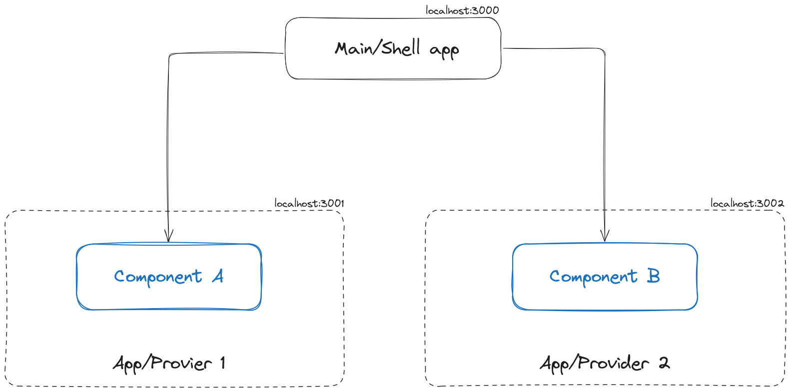

# federated-next-monorepo
Setup with Next 14 (page routing) + Module Federation + npm workspaces + scss.

## The Idea
- A main/shell application that does not expose any remote but servers as global container
- Multiple apps/providers that share components through Module Federation's remote at `src/packages/*`


## Demo
- Shell `./` : https://federated-next-monorepo.vercel.app
- Provider one `./src/packages/provider-one`: https://federated-next-monorepo-provider-one.vercel.app
- Provider two `./src/packages/provider-two`: https://federated-next-monorepo-provider-two.vercel.app


## Getting started
Clone project
``` bash
git clone https://github.com/Staslios/federated-next-monorepo.git
```

then install deps
``` bash
cd federated-next-monorepo
npm i 
```

at last start project in dev mode
``` bash
npm run dev-all
```

OR

If you have using Docker just run the `docker-compose.yml`, and it's ready to go.

It will start the main/shell app on localhost:3000 and the providers on :3001 and :3002

## Features
- Both Node and Docker support
- All applications can be run as standalone project.
- Exposed components from `.src/packages/[app]`.
- Providers are manager via NPM workspaces, `node_modules` are all at root project.

## Dependencies
- **@module-federation/nextjs-mf**: core module module federation module for next.
- **cross-env**: solves environment variables problem between win and unix machines.
- **rimraf**: same as cross-env but for the command remove `rm -rf`.
- **sass**: I guess why not?.
- **webpack**: Even tho Next comes with webpack we need it to install in order to work with Module Federation.
- **concurrently**: It is a better version of 'npm run something & npm run something'.

## Bugs
- Seems that Module Federation remotes do not work properly with Next standalone build, if you have found a solution please hit me up.

## Roadmap
- ~~Docker build with federated modules~~
- ~~Docker multi-stage build~~
- ~~Next standalone build~~ Kinda dead end on this point
- Docker compose optimization - WIP
- Deploy on remote domain